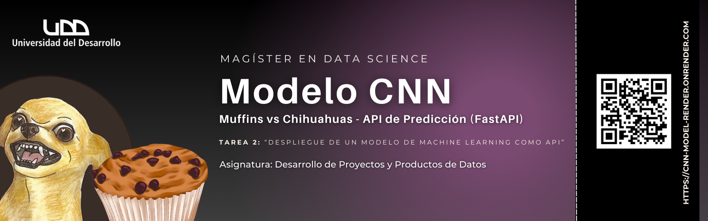

<p align="left">
   
   
   



## **Muffins vs Chihuahuas — API de Predicción (FastAPI)**
### **Tarea 2 - Desarrollo de Proyectos y Productos de Datos**

Este proyecto consiste en un servicio web que encapsula un modelo CNN (Keras/TensorFlow) para clasificar imágenes entre muffin y chihuahua.

El modelo fue entrenado para clasificación binaria con salida ```sigmoid(1)```, por lo que la probabilidad que retorna corresponde a la clase de índice 1 (ver ```artifacts/labels.json```).

- **Estado actual:** API probada localmente con Uvicorn y Swagger.
- **Despliegue en Render:** pendiente 

### Estructura del proyecto

```
.
├─ app/
│  ├─ config.py       # configuración (IMG_SIZE, rutas, flags)
│  ├─ inference.py    # carga bajo demanda del modelo y predicción
│  ├─ main.py         # FastAPI (endpoints /health y /predict)
│  ├─ schemas.py      # validaciones con Pydantic
│  └─ utils.py        # carga/transformación de imágenes
├─ artifacts/
│  ├─ model.keras     # modelo entrenado (CNN)
│  └─ labels.json     # etiquetas por índice
├─ client/
│  └─ client.py       # script de pruebas (3 peticiones)
├─ scripts/
│  └─ train_cnn.py     # entrenamiento + exportación de artifacts
├─ environment.yml     # entorno Conda (recomendado)
├─ requirements.txt    # (para Render u otros entornos con pip)
└─ README.md
```

### Requisitos

- **Recomendado (local):** Conda + Python 3.10.8
- **TensorFlow: 2.10.0** (compatibilidad con NumPy 1.23.5)
- **FastAPI + Uvicorn + Pydantic + Pillow + Requests**

### Instalación y configuración del entorno

#### Opción A - Conda
```bash
conda env create -f environment.yml
conda activate <nombre_entorno>
```
#### Opción B - pip (útil para Render u otros entornos sin conda)
```bash
pip install -r requirements.txt
```

### Variables de entorno / Configuración del modelo
El modelo es binario con salida ```sigmoid(1)```. La probabilidad corresponde a la clase de índice 1 en ```artifacts/labels.json```.
```
$env:BINARY_SIGMOID="true"
$env:POSITIVE_CLASS="muffin"
```

O bien, fijar estos valores directamente en ```app/config.py```.

### Ejecutar el servidor local
```
uvicorn app.main:app --reload --port 8000
```
- **Health:** ```http://127.0.0.1:8000/health```
- **Docs (Swagger):** ```http://127.0.0.1:8000/docs```


### Cómo hacer peticiones (Swagger, curl, Postman)

#### Swagger UI (/docs)
- ```POST /predict``` → “Try it out”

```json
{
  "image_url": "https://cdn.pixabay.com/photo/2014/09/19/21/47/chihuahua-453063_1280.jpg"
}
```
#### PowerShell (Windows)
```bash
$img = "https://cdn.pixabay.com/photo/2014/09/19/21/47/chihuahua-453063_1280.jpg"
$body = @{ image_url = $img } | ConvertTo-Json
Invoke-RestMethod -Method Post -Uri "http://127.0.0.1:8000/predict" -Body $body -ContentType "application/json"
```

### Cómo hacer peticiones a la API (payloads)

#### Endpoint
- ```GET /health``` → verifica carga de artefactos
- ```POST /predict``` → clasificación de imagen


#### Request body (Se debe elegir uno)

Por URL
```json
{
  "image_url": "https://recetaamericana.com/wp-content/uploads/2022/07/mejor-magdalenas-chispas-chocolate-300x300.jpg"
}
```
Por Base64
```json
{
  "image_b64": "<CADENA_BASE64>"
}
```
Ejemplo de Respuesta (200)
```json
{
  "label": "muffin",
  "score": 0.9931,
  "probabilities": {
    "muffin": 0.9931,
    "chihuahua": 0.0069
  }
}
```
Ejemplo de Errores (400)
- Estructura inválida (ambos o ninguno):
    ```json
    {"detail":"Debes enviar exactamente uno: 'image_url' o 'image_b64'."}
    ```
- Imagen/base64 inválidos:
    ```json
    {"detail":"prediction_error: <detalle>"}
    ```

### Cliente Externo (3 requests)

Script que realiza tres peticiones: 2 por URL (muffin/chihuahua) y 1 por base64 (imagen local).  

```bash
# Local:
# PowerShell : $env:API_URL="http://127.0.0.1:8000"

# Producción (Render):
# PowerShell : $env:API_URL="https://cnn-model-render.onrender.com"

python client/client.py
```

```client/client.py``` imprime entrada y salida por cada request.

 ***Estado:** probado localmente (Uvicorn) y en producción (Render) con respuestas correctas*


### Despliegue en Render

**URL:** https://cnn-model-render.onrender.com

#### Web Service (Desde UI Render)

- **Build Command:** pip install -r requirements.txt
- **Start Command:** ```uvicorn app.main:app --host 0.0.0.0 --port $PORT```
- **Environment Variables:**
    - ```PYTHON_VERSION=3.10.8```
    - ```IMG_SIZE=128```
    - ```MODEL_PATH=artifacts/model.keras```
    - ```LABELS_PATH=artifacts/labels.json```
    - ```BINARY_SIGMOID=true```
    - ```POSITIVE_CLASS=<clase_en_indice_1> (ejemplo: muffin)```
    - ```ALLOW_ORIGINS=*```

#### Verificación en producción

- **Health:** GET https://cnn-model-render.onrender.com/health → {"status":"ok"}
- **Swagger UI:** GET https://cnn-model-render.onrender.com/docs
- Ejemplo (PowerShell):
    ```bash
    $service = "https://cnn-model-render.onrender.com"
    Invoke-RestMethod -Method Get -Uri "$service/health"
    $img = "https://recetaamericana.com/wp-content/uploads/2022/07/mejor-magdalenas-chispas-chocolate-300x300.jpg"
    $body = @{ image_url = $img } | ConvertTo-Json
    Invoke-RestMethod -Method Post -Uri "$service/predict" -Body $body -ContentType "application/json"
    ```

### Información Extra

Este es un proyecto educativo orientado a mostrar buenas prácticas de empaquetado y despliegue de un modelo de Machine Learning como servicio web. Si necesitas reproducir el entrenamiento, ver ```scripts/train_cnn.py``` y la estructura del dataset en ```data/```.